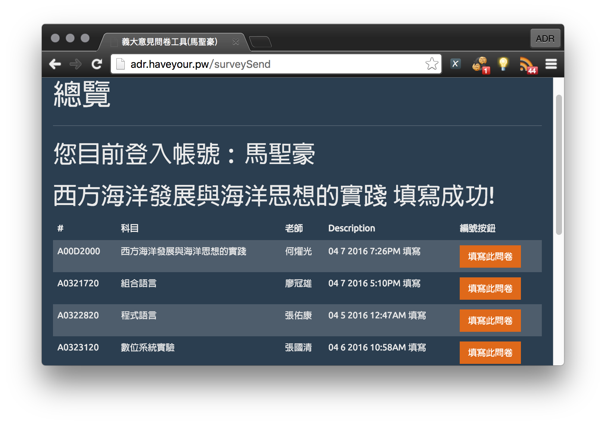

# Node-isuSurvey
=========

這是什麼？
---------
這是專屬於義守大學的教學意見機器人，以 Node.js 做開發的開源網頁版本機器人   
由我另一個開源 C# 的專案 [isuSurvey-v2](https://github.com/aaaddress1/isuSurvey-v2) 改寫而來。

如何使用？
---------
如果您正在尋找網頁版本，請至[義守大學教學意見調查表機器人](http://adr.haveyour.pw)  
如有特殊需求也可下載此份專案自行部署使用。
